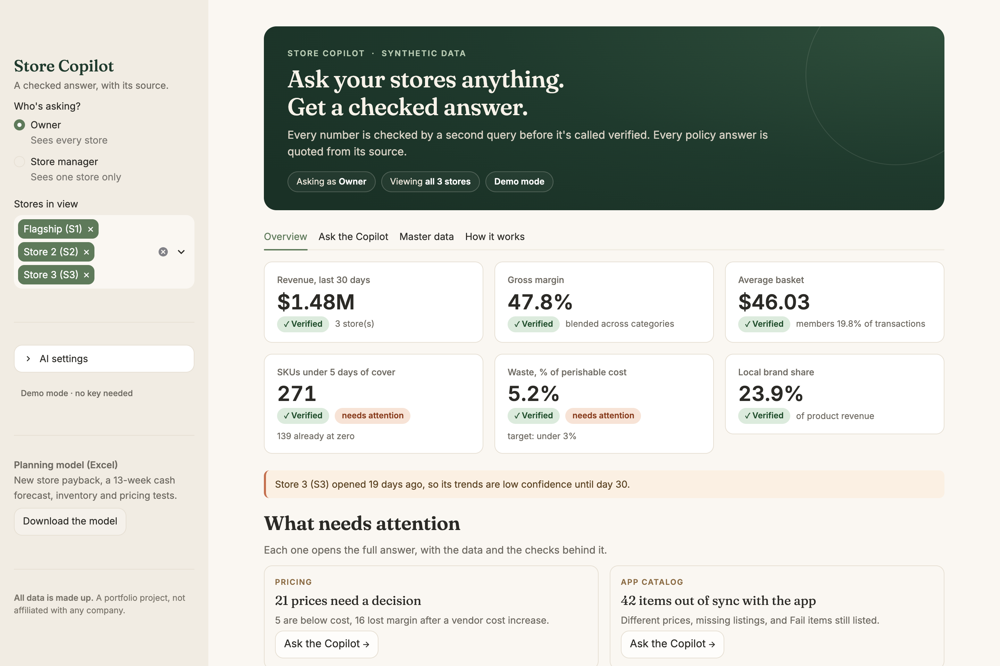
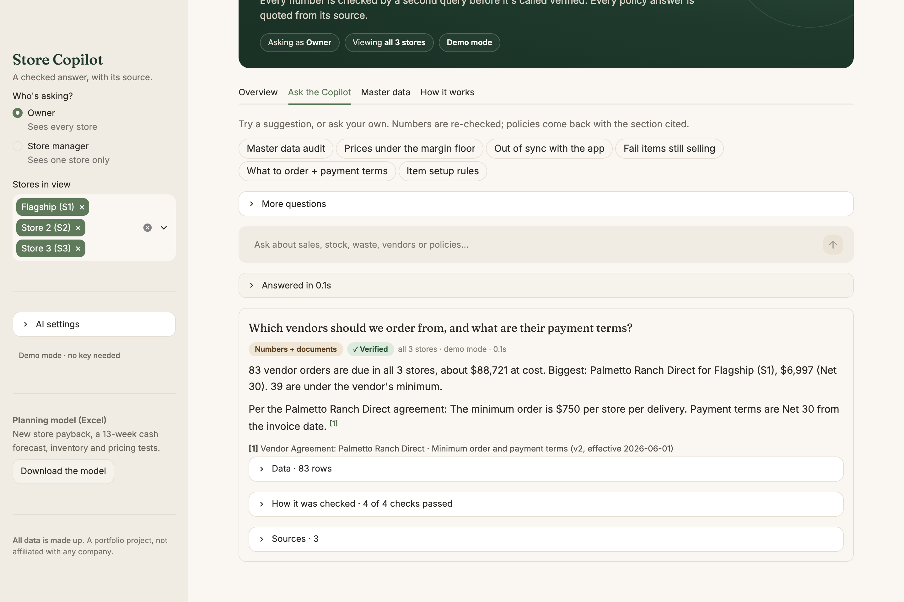
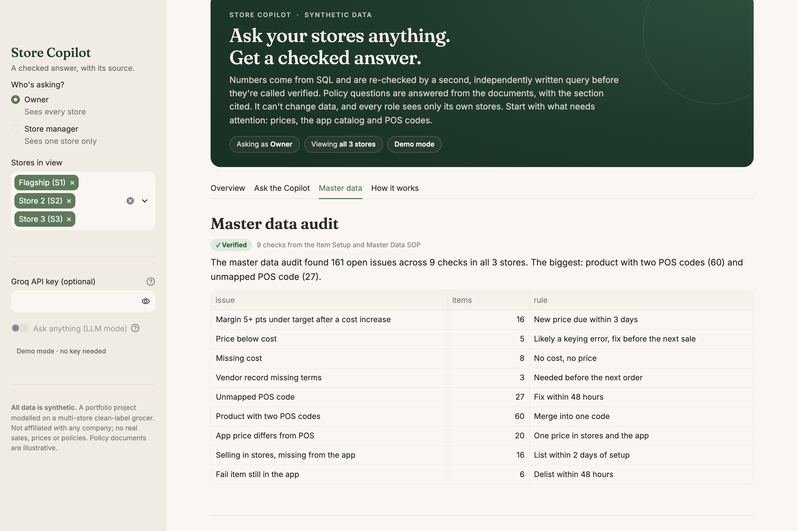
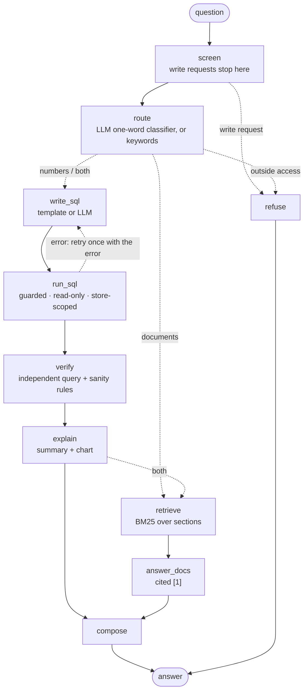

# Store Copilot

**Ask a multi-store grocer's numbers and policies in plain English. Get back a checked number, or the policy section it came from.**

LangChain + LangGraph · text-to-SQL with an independent verifier · BM25 retrieval over SOPs and vendor agreements · per-store access control enforced in code · runs free, with or without an API key.

**Live demo:** [store-copilot-demo.streamlit.app](https://store-copilot-demo.streamlit.app/) &nbsp;·&nbsp; **Run it locally:** [2 commands](#run-it-locally)

> **All data is synthetic.** This is an application project modelled on a multi-store clean-label grocer. It is not affiliated with any company and contains no real sales, prices or policies. The policy documents are illustrative.



## What it does

A store manager types a question. The Copilot decides whether it needs **numbers**, **documents**, **both**, or a polite **no**:

| Question | What happens |
|---|---|
| "What needs fixing in master data?" | Runs a 9-check audit (prices below cost, cost increases nobody repriced, missing costs, POS codes, app catalog drift), **Verified**, each check with the rule it enforces |
| "Which items are out of sync with the app?" | POS vs membership-app catalog: different prices, missing listings, Fail items still listed |
| "Which Fail items are still selling?" | SQL → re-checked by a second, independent query → **Verified** table + one-paragraph summary |
| "What's Palmetto's minimum order?" | Retrieves the vendor agreement section and quotes it, cited `[1]` |
| "Which vendors should we order from, and what are their payment terms?" | Both: the order list, then the agreement **for the vendor at the top of that list** |
| "Delete the duplicate POS codes." | Refused by the first node, before any model sees it |
| A Store 2 manager asks "How did the flagship do?" | "That data is outside your store access." |



## Master data, the analyst's weekly audit

Most wrong numbers in a grocery business start as wrong master data: a cost that went up and nobody repriced, a price keyed at a tenth of its value, an item that went live without a cost, a POS code nobody mapped, an app catalog that drifted from the POS. The synthetic data has all of these on purpose, and the **Master data** tab (or "What needs fixing in master data?") runs the audit an analyst would run every Monday:

| Check | Rule it enforces |
|---|---|
| Margin 5+ points under target after a vendor cost increase | New price within 3 days |
| Price below cost | Likely a keying error, fix before the next sale |
| Missing cost | No cost, no price |
| Vendor record missing terms | Needed before the next order |
| Unmapped POS code / product with two codes | Fix within 48 hours / merge into one code |
| App price differs from POS | One price in the stores and the app |
| Selling in stores, missing from the app | List within 2 days of setup |
| Fail item still in the app | Delist within 48 hours |



Each check is one line of SQL in [`copilot/templates.py`](copilot/templates.py), the whole audit is verified by an independently written query, and the rules come from an illustrative [Item Setup and Master Data SOP](docs/item_setup_master_data_sop.md) the Copilot can also quote.

## Why numbers go to SQL and documents go to retrieval

A number has one right answer that a database can compute exactly. Asking a language model to recall it invites a confident guess. A policy is wording, so the job is to find the right section and quote it with a citation. The router sends each question to the tool built for it, and questions that need both get both.

## Architecture

The engine is a **LangGraph** `StateGraph`. The app draws this diagram live from the compiled graph (How it works tab).



**LangChain vs LangGraph, in this project.** LangChain supplies the parts: `ChatPromptTemplate | ChatGroq | StrOutputParser` chains, a model `.with_fallbacks()`, and a custom `BaseRetriever`. LangGraph supplies the control flow a sequential chain can't express cleanly:
- conditional routing to four outcomes;
- a bounded retry loop (the guard rejects the SQL, and the model gets its SQL and the error back, once);
- one typed state that every node reads and writes. That shared state is how the documents step knows which vendor the numbers step found;
- node-by-node streaming, which the UI shows as live progress ("Wrote the SQL ✓ Checked it with an independent query ✓").

## The verifier

In my [Yardstick](https://a28-2001.github.io/yardstick/) study of LLM-written SQL, 82-97% of wrong queries ran without error and returned plausible numbers. So "the query ran" proves nothing. Here a number is only labelled **Verified** when:

1. **An independent query agrees.** In demo mode, each of the 16 question templates carries a hand-written check query that computes the same thing a different way (julianday instead of `date()`, subqueries instead of joins, raw sales instead of the velocity view). In LLM mode, the model writes a second formulation and `compare_frames` checks that the results match within 0.5%.
2. **Sanity rules pass:** the result isn't empty; there are no negative units, revenue, stock, cost or cover; there are no missing store, SKU or category keys.

If the checks disagree, the answer says so ("the checks don't agree, treat this number with caution") and the Checks panel shows why. A test plants a silent error (revenue × 2, which runs fine) and asserts it gets flagged.

## Safety, enforced in code

None of this depends on the prompt. A model that ignores its instructions still can't get past it.

1. **Read-only file.** SQLite opens with `mode=ro`.
2. **SQL guard.** `sqlglot` parses the query. It must be exactly one `SELECT`/`WITH`, with no `PRAGMA`, `ATTACH` or DDL/DML, no schema-qualified names, and only allow-listed tables.
3. **Store scope.** Each connection creates `TEMP VIEW`s that shadow every store-level table with only the user's stores. An SQLite **authorizer** then denies any read of the real tables that doesn't come through those views. That closes bypasses like `main.sales_daily` or a derived view, even if the guard were skipped. The tests do exactly that.
4. **Budgets.** 5 seconds per query (progress handler) and at most 500 rows.
5. **Before any LLM call,** requests to delete, update or re-price are refused.

The How it works tab has a **"Try to break it"** box: run an attack as the current role and see which layer stops it.

## Multi-store by design

Every table carries a `store_id`, and stores are config (`config/stores.yaml`), not code. **Adding store 4 is one entry there.** A store with less than 30 days of history is flagged automatically ("Store 3 has only 19 days of history…"). The flagship-vs-new-store assortment gap is one of the built-in questions.

## What the synthetic business models

| What a clean-label grocer cares about | Where it shows up |
|---|---|
| Strict ingredient vetting | Clean Ingredient Standard doc; `clean_standard_status` on every SKU; a watchlist of Fail items still selling |
| Emerging and local brands | `is_local_brand`, local brand share KPI, the 60-day trial rule |
| Fresh cafe, hot bar and juices | Waste against the SOP's 3% target; hot bar and juice discard rules |
| Premium pricing and margin discipline | Margin vs target by category; the one-price-across-stores policy |
| Growing from 1 to 3+ stores | `store_id` everywhere, config-driven stores, low-history flag, assortment gap |
| Clean master data | Vendor cost increases, price typos, missing costs and incomplete vendor records injected on purpose; a weekly audit |
| A messy SKU list | 60 duplicate POS codes and 27 unmapped ones injected on purpose |
| A membership app | An app catalog that must match the POS; member share of transactions rising from 8% to ~20% |

The data: 3 stores, 2,000 SKUs, 90 days, about 137K sales rows. It's seeded (`--seed 7`) and calibrated to about $26K/day at the flagship, a 47-48% blended margin and a ~$46 basket.

## Evaluation

40 golden questions ([`eval/golden.yaml`](eval/golden.yaml)), written in everyday phrasing before the first run: 20 numbers questions across the original 13 templates (the 3 master data templates are covered by the tests, not the golden set), 12 policy questions with the expected document section, 4 mixed, and 4 traps (3 write requests, 1 off-topic).

**The headline:** in the latest LLM run, **every answer labelled Verified was correct (18 of 18), and both wrong answers were flagged, not verified.** The verifier leans cautious: 4 correct answers went unverified because the second query failed or disagreed.

| Metric | Demo, first run | Demo, after fixes | LLM, first run | LLM, second run |
|---|---|---|---|---|
| Routing accuracy | 88% (35/40) | 98% (39/40) | 98% (39/40) | 98% (39/40) |
| Retrieval hit@3 | 69% (11/16) | 75% (12/16)⁴ | 81% (13/16) | 81% (13/16) |
| Answer accuracy | 83% (20/24)¹ | 100% (24/24)¹ | not measured² | **92% (22/24)**; 75% (18/24) with keys as first written³ |
| Exact table match (strict) | n/a | n/a | 4% (1/24) | 33% (8/24) |
| Verification rate | 100% (22/22) | 100% (24/24) | 68% (15/22) | 75% (18/24) |
| Silent errors (Verified but wrong) | 1 of 24 | 0 of 24 | not measured² | **0 of 24**; 4 with keys as first written³ |
| Traps handled | 4/4 | 4/4 | 4/4 | 4/4 |
| False refusals | 0 | 0 | 0 | 0 |
| Median latency | 0.01 s | 0.01 s | 13.7 s | 13.0 s |

¹ Demo mode: the expected template answered. ² The first LLM run only had the strict exact-table grader. ³ See "answer keys" below. ⁴ It was 81% (13/16) before the Item Setup SOP was added: the new document now outranks the right section for "Who reviews new SKUs before they get a price?". Adding a document can shift keyword rankings; I left the regression visible rather than rewording the documents to win it back.

How to read this honestly. Every mode was run twice, and **the second runs are optimistic**, because I fixed what the first runs exposed:
- **Demo mode.** The first run's misses were whole classes of phrasing the keyword router didn't know ("When should…", "per day", "wasting"). I fixed the classes and checked the fixes on a separate [dev set](eval/dev.yaml) (11/12), but I had seen the golden misses. The one demo-mode silent error is instructive: "Plot revenue per day for each store" matched the revenue-by-store template, which verified perfectly. The checks confirm the math, not the reading of the question.
- **LLM mode, run 1 → run 2.** The first run scored 4% on a strict exact-table grader, and reading its answers showed the grader was mostly at fault. It answered "how much did each store sell?" with exactly the right revenue but without the extra columns the template has. It found the same three below-target categories over 90 days instead of the templates' 30. The spec's 50-row cap made a 271-row list unmatchable. Before run 2, I wrote down the business conventions the templates silently assumed (default time windows, what "duplicate POS code" and "running low" mean) and lifted the row cap.
- **Answer keys.** A template answers its own question, which isn't always the golden phrasing: "Fail items" is not "Fail and Review items". So each numbers question has an [answer key](eval/answer_keys.yaml): the facts a correct answer must contain, with declared alternatives for genuinely ambiguous wording ("this month" as the last 30 days or month to date). I read all six misses of run 2 by hand. Two were real errors, and both were caught: one returned nothing (not verified) and one tripped the verifier (checks disagree). The other four were valid readings the keys hadn't allowed, such as local-brand share of *all* sales (exactly as the schema defines it) or "how many shoppers are members" answered as a count. I added those readings, marked "added after review", and both gradings are reported.
- **Model mix.** Groq's free tier rate-limited the 120B model mid-run, so 56 of 121 calls in run 2 were answered by the gpt-oss-20b fallback. The numbers above are for that mix.
- Retrieval misses are real BM25 limits, e.g. "marked down" never matches the word "markdown".
- Every run, with every question and miss listed, is in [`eval/`](eval/).

## Limits

- **Synthetic data.** No real sales, prices or policies.
- **BM25, not embeddings.** Exact-term search suits short policies full of vendor names and numbers, but it misses paraphrases that share no words with the text ("dress code" even matches "POS codes"). Embeddings are a drop-in upgrade behind the same `BaseRetriever` interface; I skipped them so the app needs no model download.
- **40 questions** catch regressions. They aren't a benchmark.
- **Verified is not proven.** Two queries agreeing makes a silent error much less likely, not impossible: both can share the same wrong assumption.
- **Not production.** There's no auth provider, no audit log and no live POS feed.

## Connecting real data

The schema mirrors what a typical grocery POS can export: an item list (→ `sku_master`), per-store item codes (→ `sku_map`), daily item sales (→ `sales_daily`), inventory counts (→ `inventory_current`), shrink logs (→ `waste_daily`), and ticket counts (→ `transactions_daily`). A nightly job would load those CSVs into the same tables. Nothing above the database changes. The Master data tab is where a messy item list would surface first.

## Run it locally

```bash
pip install -r requirements.txt && streamlit run streamlit_app.py
```

The database builds itself on first run (about a second). It runs in **demo mode** with no key. With a key, the suggestion buttons still answer instantly from the verified question library, and typed questions go to the LLM. For **LLM mode**, get a free key at [console.groq.com](https://console.groq.com) and paste it into the sidebar, or put `GROQ_API_KEY = "..."` in `.streamlit/secrets.toml`. The app checks the key before switching modes.

```bash
pytest                                  # 51 tests, no key needed (the LLM path uses a fake model)
python eval/run_eval.py --mode demo     # the 40-question evaluation
python data/generate.py --seed 7        # rebuild the synthetic database
```

## Repo layout

```
config/stores.yaml     stores are config, not code
data/generate.py       synthetic data -> data/store.db (git-ignored, built on first run)
docs/                  illustrative policies, SOPs (incl. item setup), vendor agreements (+ archive/ for superseded versions)
copilot/db.py          read-only, store-scoped DB: sqlglot guard, TEMP VIEW scope, authorizer, budgets
copilot/templates.py   16 demo questions (incl. the master data audit), each with an independent check query
copilot/verifier.py    independent-check + sanity rules, compare_frames
copilot/rag.py         section chunking + BM25 BaseRetriever with version filter and relevance floor
copilot/engine.py      the LangGraph: screen -> route -> numbers / documents / both / refuse
copilot/llm.py         ChatGroq with fallback; key resolution and key check
streamlit_app.py       the app
eval/                  golden set, dev set, runner, results
tests/                 pytest suite
```

## Build notes

- The spec named `llama-3.3-70b-versatile` with an `llama-3.1-8b-instant` fallback. Groq retired both in 2026 (they return `404 model_not_found`), so it's `openai/gpt-oss-120b` with an `openai/gpt-oss-20b` fallback. Both can be overridden with the `COPILOT_PRIMARY_MODEL` and `COPILOT_FALLBACK_MODEL` env vars.
- Missing indexes turn 0.1 s queries into timeouts. A late one (`sku_map(store_id, master_sku_id)`) cut the slowest check query from about 180 ms to about 50 ms.
- The chart palette was checked with a colorblind-safety validator. The first earthy palette failed (sage next to terracotta is nearly identical for red-green colorblind viewers), so the stores use green, blue and ochre, and terracotta is kept for warnings.
